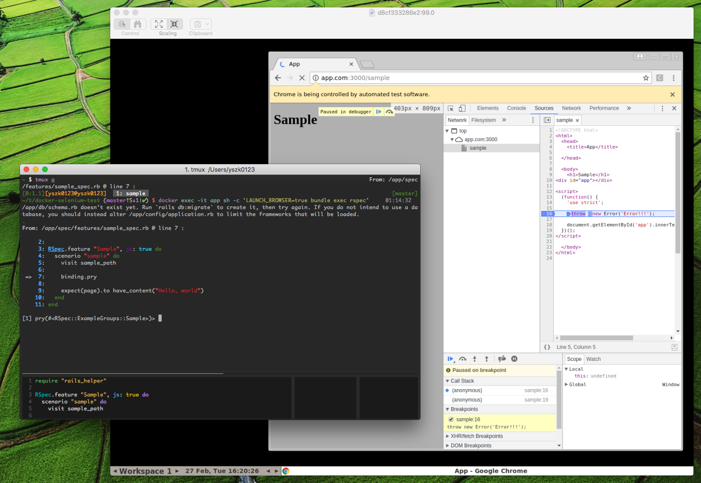

# Development

1. `$ docker-compose up -d`
1. `$ open vnc://localhost:5900`
    - cf. https://github.com/SeleniumHQ/docker-selenium#debugging
1. Enter password (default: `secret`)
1. Run RSpec `$ docker exec -it app sh -c 'LAUNCH_BROWSER=true bundle exec rspec'`

# Files

## Docker settings

- [Dockerfile](Dockerfile)
- [docker-compose.yml](docker-compose.yml)

## Sample pages and tests

- [app/views/sample/index.html.erb](app/views/sample/index.html.erb)
- [spec/features/sample_spec.rb](spec/features/sample_spec.rb)

## Capybara and Selenium settings

- [spec/rails_helper.rb](spec/rails_helper.rb)
